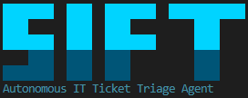
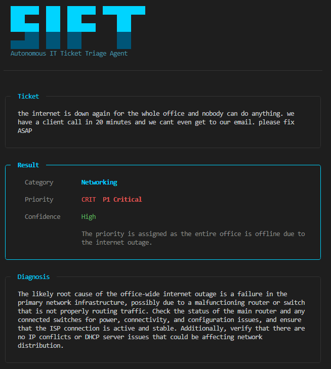
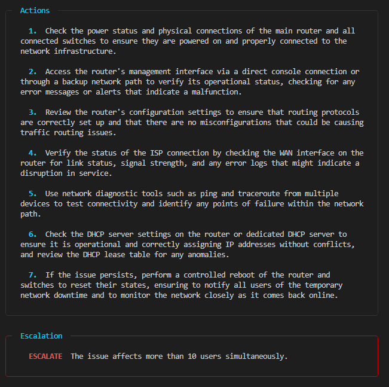

<p align="center">
  
</p>

<p align="center">
  <strong>Reads raw IT tickets. Returns structured resolution paths.</strong>
</p>

SIFT is an open source autonomous IT ticket triage agent built for Managed Service
Providers (MSPs). It takes raw, unstructured support ticket text and returns a structured
resolution path including category, priority, diagnosis, step by step actions, and an
escalation decision. SIFT covers networking, cloud infrastructure, security, endpoint,
and identity tickets using a six node LangGraph state graph with structured LLM reasoning.

## Demo





## Installation

1. Clone the repo:
   ```bash
   git clone https://github.com/najmulhasan-code/sift.git
   cd sift
   ```

2. Install dependencies:
   ```bash
   pip install -r requirements.txt
   ```

3. Set up your API key:
   ```bash
   cp .env.example .env
   # Open .env and replace your_openai_api_key_here with your actual key
   ```

4. Run it:
   ```bash
   python sift.py --demo
   ```

## Usage

### Interactive Mode (default)
```bash
python sift.py
```
Prompts you to enter a ticket. Press Enter twice when done. After each triage, choose
whether to continue.

### Single Ticket
```bash
python sift.py --ticket "VPN not connecting for remote user since this morning"
```
Triages one ticket and exits.

### Demo Mode
```bash
python sift.py --demo
```
Runs five sample tickets automatically with full triage output.

## Architecture

SIFT uses a LangGraph state graph with six nodes. Each node calls GPT 4o with a
structured prompt, updates specific fields in the shared state, and passes control
to the next node.

```
extract -> classify -> prioritize -> diagnose -> resolve -> evaluate
```

| Node | Purpose |
|------|---------|
| **extract** | Pulls key technical details from the raw ticket text |
| **classify** | Assigns one of six category labels |
| **prioritize** | Sets P1 through P4 priority with a justification |
| **diagnose** | Writes a 2 to 3 sentence technical root cause analysis |
| **resolve** | Generates 4 to 7 concrete, actionable resolution steps |
| **evaluate** | Decides on escalation and assesses triage confidence |

## Ticket Categories

| Category | Example Ticket Types |
|----------|---------------------|
| Networking | VPN down, DNS failure, firewall block, office connectivity outage |
| Cloud Infrastructure | AWS service failure, Azure VM issues, cloud storage problems |
| Security | Phishing email, ransomware, suspicious login, account compromise |
| Endpoint | Laptop will not boot, printer jammed, software install needed |
| Identity | Password reset, MFA lockout, new user provisioning, access denied |

## Priority Levels

| Level | Description | Example |
|-------|-------------|---------|
| P1 Critical | Full outage or active security breach | Entire office offline, ransomware detected |
| P2 High | Single user blocked or production degraded | User cannot access any systems, website slow |
| P3 Medium | Performance issue or non critical system down | Application sluggish, backup job failing |
| P4 Low | Minor inconvenience or information request | How to question, font size preference |

